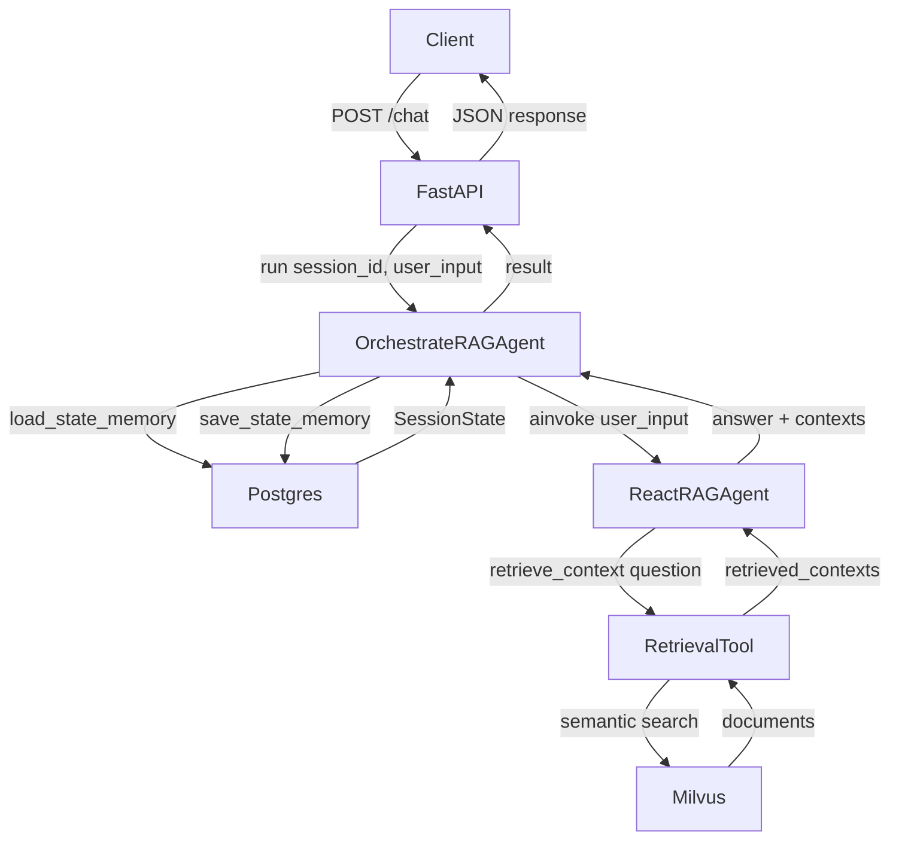

# RAG React Agent Orchestration Flow

## Architecture Overview

The RAG AI Agent uses a LangChain ReAct agent pattern for intelligent retrieval-augmented generation. The architecture consists of two main components:

- **OrchestrateRAGAgent**: Manages session state persistence and coordinates the agent workflow
- **ReactRAGAgent**: Implements the ReAct (Reasoning + Acting) pattern with tool calling

## Orchestration Flow



## Flow Description

### Phase 1: Request Handling

- **Client** sends a POST request to `/chat` with `session_id` and `user_input`
- **FastAPI** routes the request to `OrchestrateRAGAgent.run()`

### Phase 2: State Management

- **OrchestrateRAGAgent** loads existing session state from PostgreSQL
- If no state exists, a new `SessionState` is created with the provided `session_id`

### Phase 3: ReAct Agent Execution

- **ReactRAGAgent** receives the user input and executes the ReAct loop:
  1. The agent reasons about what action to take
  2. Calls the `retrieve_context` tool to fetch relevant documents from Milvus
  3. Receives retrieved contexts and chunk IDs
  4. Generates a final answer based on the retrieved context

### Phase 4: State Persistence

- **OrchestrateRAGAgent** updates the session state with:
  - Current user input
  - Agent response
  - Retrieved chunk IDs
  - Conversation history (user + assistant messages)
- State is persisted to PostgreSQL for future requests

## Components

| Component | Type | Description |
| --- | --- | --- |
| `OrchestrateRAGAgent` | Orchestrator | Manages session state and coordinates agent workflow |
| `ReactRAGAgent` | ReAct Agent | LangChain agent with tool calling capabilities |
| `retrieve_context` | Tool | Performs semantic search on Milvus vector database |
| `SessionState` | State Model | Pydantic model for session persistence |

## Session State Schema

```python
class SessionState(BaseModel):
    session_id: str
    user_input: str | None
    conversation_history: list[dict[str, Any]]
    retrieved_context: list[dict[str, Any]]
    response: str
```

## API Response

The `/chat` endpoint returns the full `SessionState` model:

```json
{
  "session_id": "session-123",
  "user_input": "What is the main topic?",
  "response": "Generated response based on retrieved context",
  "retrieved_context": [
    {"content": "Retrieved passage 1"},
    {"content": "Retrieved passage 2"}
  ],
  "conversation_history": [
    {"role": "user", "content": "What is the main topic?"},
    {"role": "assistant", "content": "Generated response based on retrieved context"}
  ]
}
```
