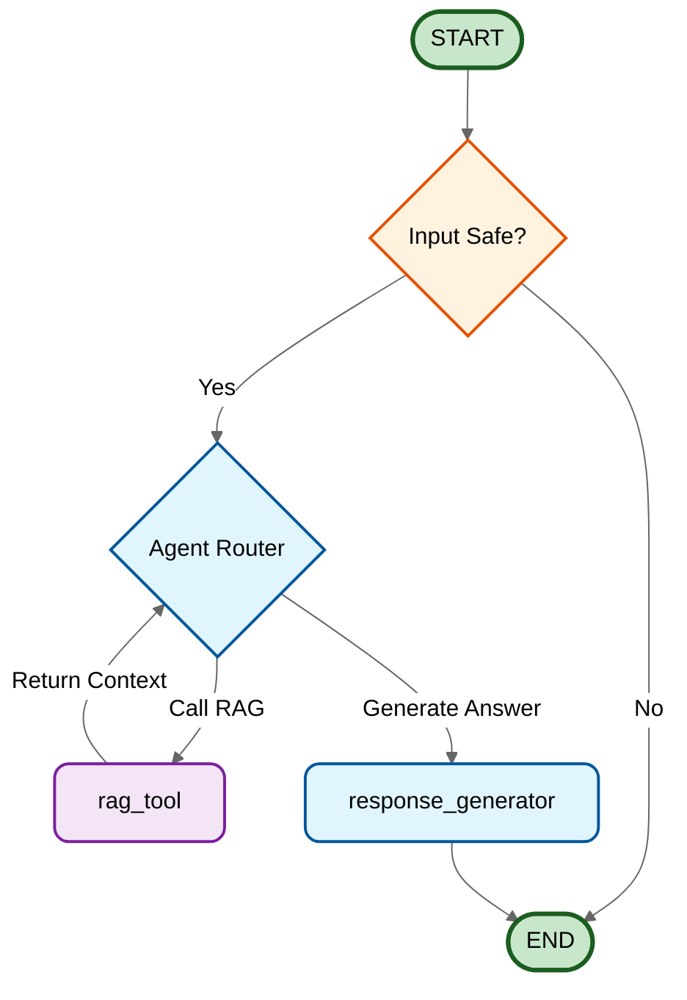

# LangGraph Orchestration Flow

## Orchestration Graph

## Flow Description

### Phase 1: Input Analysis

* **START** → `input_guard`: The entry point where the user query is received.
* `input_guard`: checks the query for safety (PII, jailbreaks, etc.) and appropriateness. If unsafe, it terminates the flow immediately.

### Phase 2: Agent Reasoning

* **Agent Loop**: The `agent` acts as the reasoning engine (Router). It determines if it has enough information to answer:
* If **No**: It routes to the `rag_tool`.
* If **Yes**: It routes to the `response_generator`.

### Phase 3: Retrieval (RAG)

* `rag_tool`: Retrieves relevant documents from the vector database (e.g., Milvus) based on the query.
* **Return**: The retrieved context is passed back to the `agent` to re-evaluate the answer.

### Phase 4: Response Generation

* `response_generator`: Synthesizes the final answer using the chat history and retrieved context, formatting it strictly for the user.
* **END**: Delivers the final payload to the client.

### Nodes Dictionary

| Node Name | Type | Description |
| --- | --- | --- |
| `input_guard` | Conditional | Validates input for safety. Redirects unsafe inputs to END. |
| `agent` | LLM / Router | The central brain. Decides whether to call tools or generate a final answer. |
| `rag_tool` | Tool | Performs semantic search to retrieve external context. |
| `response_generator` | Output | Formats the final answer into the desired schema/style. |